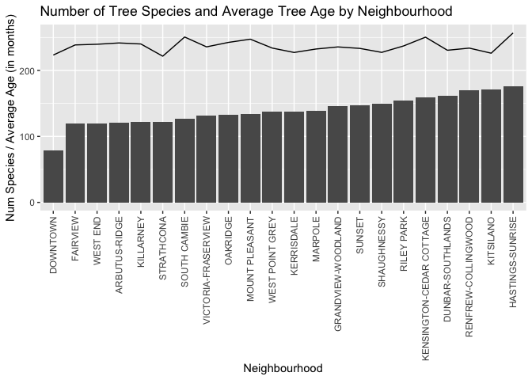
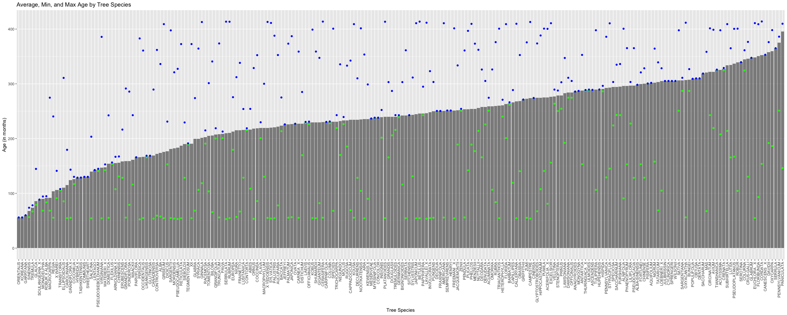
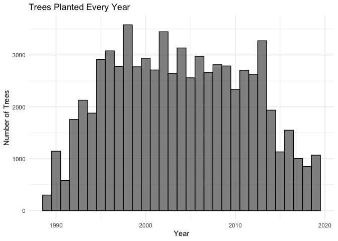
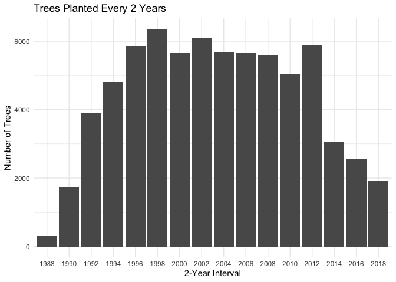
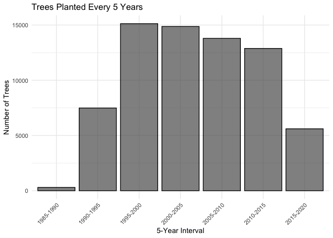
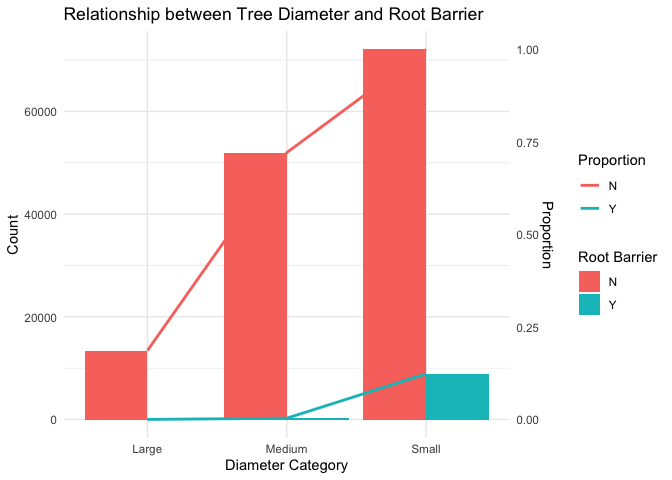
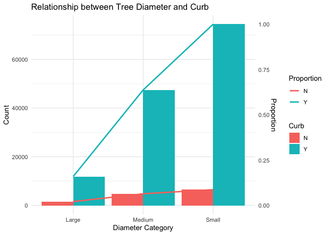

Mini Data Analysis Milestone 2
================

*To complete this milestone, you can either edit [this `.rmd`
file](https://raw.githubusercontent.com/UBC-STAT/stat545.stat.ubc.ca/master/content/mini-project/mini-project-2.Rmd)
directly. Fill in the sections that are commented out with
`<!--- start your work here--->`. When you are done, make sure to knit
to an `.md` file by changing the output in the YAML header to
`github_document`, before submitting a tagged release on canvas.*

# Welcome to the rest of your mini data analysis project!

In Milestone 1, you explored your data. and came up with research
questions. This time, we will finish up our mini data analysis and
obtain results for your data by:

- Making summary tables and graphs
- Manipulating special data types in R: factors and/or dates and times.
- Fitting a model object to your data, and extract a result.
- Reading and writing data as separate files.

We will also explore more in depth the concept of *tidy data.*

**NOTE**: The main purpose of the mini data analysis is to integrate
what you learn in class in an analysis. Although each milestone provides
a framework for you to conduct your analysis, it’s possible that you
might find the instructions too rigid for your data set. If this is the
case, you may deviate from the instructions – just make sure you’re
demonstrating a wide range of tools and techniques taught in this class.

# Instructions

**To complete this milestone**, edit [this very `.Rmd`
file](https://raw.githubusercontent.com/UBC-STAT/stat545.stat.ubc.ca/master/content/mini-project/mini-project-2.Rmd)
directly. Fill in the sections that are tagged with
`<!--- start your work here--->`.

**To submit this milestone**, make sure to knit this `.Rmd` file to an
`.md` file by changing the YAML output settings from
`output: html_document` to `output: github_document`. Commit and push
all of your work to your mini-analysis GitHub repository, and tag a
release on GitHub. Then, submit a link to your tagged release on canvas.

**Points**: This milestone is worth 50 points: 45 for your analysis, and
5 for overall reproducibility, cleanliness, and coherence of the Github
submission.

**Research Questions**: In Milestone 1, you chose two research questions
to focus on. Wherever realistic, your work in this milestone should
relate to these research questions whenever we ask for justification
behind your work. In the case that some tasks in this milestone don’t
align well with one of your research questions, feel free to discuss
your results in the context of a different research question.

# Learning Objectives

By the end of this milestone, you should:

- Understand what *tidy* data is, and how to create it using `tidyr`.
- Generate a reproducible and clear report using R Markdown.
- Manipulating special data types in R: factors and/or dates and times.
- Fitting a model object to your data, and extract a result.
- Reading and writing data as separate files.

# Setup

Begin by loading your data and the tidyverse package below:

``` r
library(datateachr) # <- might contain the data you picked!
library(tidyverse)
```

# Task 1: Process and summarize your data

From milestone 1, you should have an idea of the basic structure of your
dataset (e.g. number of rows and columns, class types, etc.). Here, we
will start investigating your data more in-depth using various data
manipulation functions.

### 1.1 (1 point)

First, write out the 4 research questions you defined in milestone 1
were. This will guide your work through milestone 2:

<!-------------------------- Start your work below ---------------------------->

1.  How does the variety of tree species differ across Vancouver
    neighbourhoods?
2.  Is there any relationship between tree species and their ages in
    Vancouver?
3.  Have there been specific periods with a surge in tree planting in
    Vancouver?
4.  Is there any relationship between diameters of trees and the
    presence of a root barrier or a curb?
    <!----------------------------------------------------------------------------->

Here, we will investigate your data using various data manipulation and
graphing functions.

### 1.2 (8 points)

Now, for each of your four research questions, choose one task from
options 1-4 (summarizing), and one other task from 4-8 (graphing). You
should have 2 tasks done for each research question (8 total). Make sure
it makes sense to do them! (e.g. don’t use a numerical variables for a
task that needs a categorical variable.). Comment on why each task helps
(or doesn’t!) answer the corresponding research question.

Ensure that the output of each operation is printed!

Also make sure that you’re using dplyr and ggplot2 rather than base R.
Outside of this project, you may find that you prefer using base R
functions for certain tasks, and that’s just fine! But part of this
project is for you to practice the tools we learned in class, which is
dplyr and ggplot2.

**Summarizing:**

1.  Compute the *range*, *mean*, and *two other summary statistics* of
    **one numerical variable** across the groups of **one categorical
    variable** from your data.
2.  Compute the number of observations for at least one of your
    categorical variables. Do not use the function `table()`!
3.  Create a categorical variable with 3 or more groups from an existing
    numerical variable. You can use this new variable in the other
    tasks! *An example: age in years into “child, teen, adult, senior”.*
4.  Compute the proportion and counts in each category of one
    categorical variable across the groups of another categorical
    variable from your data. Do not use the function `table()`!

**Graphing:**

6.  Create a graph of your choosing, make one of the axes logarithmic,
    and format the axes labels so that they are “pretty” or easier to
    read.
7.  Make a graph where it makes sense to customize the alpha
    transparency.

Using variables and/or tables you made in one of the “Summarizing”
tasks:

8.  Create a graph that has at least two geom layers.
9.  Create 3 histograms, with each histogram having different sized
    bins. Pick the “best” one and explain why it is the best.

Make sure it’s clear what research question you are doing each operation
for!

<!------------------------- Start your work below ----------------------------->

**For research question 1:** **Summarizing: Option 1**

``` r
# Since the problem is around how does the variety of tree species differ across Vancouver neighbourhoods, we can try to grab more information around trees in different neighbourhoods including the number of tree species, the average age of trees, the maximul age of trees, etc.
vancouver_trees <- vancouver_trees %>%
  mutate(age = difftime(Sys.Date(), date_planted))

vancouver_trees_summary <- vancouver_trees %>%
  group_by(neighbourhood_name) %>%
  summarise(
    num_of_species = n_distinct(species_name),
    average_age = mean(age, na.rm = TRUE),
    max_age = max(age, na.rm = TRUE),
    min_age = min(age, na.rm = TRUE)
  )
print(vancouver_trees_summary)
```

    ## # A tibble: 22 × 5
    ##    neighbourhood_name       num_of_species average_age   max_age    min_age  
    ##    <chr>                             <int> <drtn>        <drtn>     <drtn>   
    ##  1 ARBUTUS-RIDGE                       121 7249.521 days 12413 days 1664 days
    ##  2 DOWNTOWN                             79 6699.376 days 12391 days 1633 days
    ##  3 DUNBAR-SOUTHLANDS                   161 6917.902 days 12410 days 1643 days
    ##  4 FAIRVIEW                            119 7159.542 days 12343 days 1637 days
    ##  5 GRANDVIEW-WOODLAND                  146 7069.201 days 12388 days 1595 days
    ##  6 HASTINGS-SUNRISE                    176 7704.686 days 12348 days 1640 days
    ##  7 KENSINGTON-CEDAR COTTAGE            159 7513.049 days 12382 days 1644 days
    ##  8 KERRISDALE                          138 6817.113 days 12402 days 1643 days
    ##  9 KILLARNEY                           122 7203.727 days 12410 days 1605 days
    ## 10 KITSILANO                           171 6784.177 days 12314 days 1633 days
    ## # ℹ 12 more rows

**Graphing: Option 8**

``` r
# Previously, we collected information on trees based on different neighbourhoods. Therefore, we can create a visualization composed of two geom layers to represent the data we've gathered: number of tree species and the average age of the trees.

vancouver_trees %>%
  group_by(neighbourhood_name) %>%
  summarise(
    num_of_species = n_distinct(species_name),
    average_age = mean(age, na.rm = TRUE)
  ) %>%
  ggplot(aes(x = reorder(neighbourhood_name, num_of_species), y = num_of_species)) +
  geom_bar(stat="identity") +
  geom_line(aes(y = average_age / 30), group=1) +
  labs(y = "Num Species / Average Age (in months)", x = "Neighbourhood", title = "Number of Tree Species and Average Tree Age by Neighbourhood") + 
  theme(axis.text.x = element_text(angle = 90, vjust = 0.5, hjust=1))
```

<!-- -->

**For research question 2:** **Summarizing: Option 1**

``` r
# To observe the relationship between tree species and tree ages, we can calculate minimal age, maximal age, average age and the range of different tree species
vancouver_trees %>%
  group_by(species_name) %>%
  filter(!all(is.na(age))) %>% # remove entries if all values in age column are NA
  summarise(
    average_age = mean(age, na.rm = TRUE),
    min_age = min(age, na.rm = TRUE),
    max_age = max(age, na.rm = TRUE),
    range_width = max_age - min_age
  )
```

    ## # A tibble: 222 × 5
    ##    species_name   average_age   min_age   max_age    range_width
    ##    <chr>          <drtn>        <drtn>    <drtn>     <drtn>     
    ##  1 ABIES          6490.250 days 3256 days  7628 days  4372 days 
    ##  2 ACERIFOLIA   X 8249.599 days 2429 days 12013 days  9584 days 
    ##  3 ACUMINATA      7773.667 days 7531 days  8237 days   706 days 
    ##  4 ACUTISSIMA     9770.878 days 6231 days 11934 days  5703 days 
    ##  5 ALBA           5207.750 days 1731 days 10085 days  8354 days 
    ##  6 ALBA-SINENSIS  8946.667 days 8944 days  8948 days     4 days 
    ##  7 ALNIFOLIA      8876.964 days 2725 days 12019 days  9294 days 
    ##  8 AMERICANA      7521.972 days 1672 days 12321 days 10649 days 
    ##  9 ANAGYROIDES    8577.000 days 8577 days  8577 days     0 days 
    ## 10 ANTARTICA      8623.708 days 4597 days 10584 days  5987 days 
    ## # ℹ 212 more rows

\*\*\*\*Graphing: Option 8\*\*

``` r
# Previously, we collected information on tree ages based on different tree species. Therefore, we can create a visualization composed of several geom layers to represent the data we've gathered: the average age, minimal age and maximal age of trees
vancouver_trees %>%
  group_by(species_name) %>%
  filter(!all(is.na(age))) %>%
  summarise(
    average_age = mean(as.numeric(age, "days") / 30, na.rm = TRUE),
    min_age = min(as.numeric(age, "days") / 30, na.rm = TRUE),
    max_age = max(as.numeric(age, "days") / 30, na.rm = TRUE)
  ) %>%
  ggplot(aes(x = reorder(species_name, average_age), y = average_age)) +
  geom_bar(stat="identity", alpha=0.7) +
  geom_point(aes(y = min_age), color="green") +
  geom_point(aes(y = max_age), color="blue") +
  labs(y = "Age (in months)", x = "Tree Species", title = "Average, Min, and Max Age by Tree Species") + 
  theme(axis.text.x = element_text(angle = 90, vjust = 0.5, hjust=1))
```

<!-- -->

**For research question 3:** **Summarizing: Option 3**

``` r
# From an existing numerical variable 'date_planted', I created a new categorical variable called 'year_interval' that represents the intervals of 5 years
vancouver_trees_updated <- vancouver_trees %>%
  filter(!is.na(date_planted)) %>% 
  mutate(
    year = as.integer(format(date_planted, "%Y")),
    year_interval = paste0(5 * floor(year/5), "-", 5 * floor(year/5) + 5) 
  )

print(vancouver_trees_updated)
```

    ## # A tibble: 70,063 × 23
    ##    tree_id civic_number std_street    genus_name species_name cultivar_name  
    ##      <dbl>        <dbl> <chr>         <chr>      <chr>        <chr>          
    ##  1  149556          494 W 58TH AV     ULMUS      AMERICANA    BRANDON        
    ##  2  149563          450 W 58TH AV     ZELKOVA    SERRATA      <NA>           
    ##  3  149579         4994 WINDSOR ST    STYRAX     JAPONICA     <NA>           
    ##  4  149590          858 E 39TH AV     FRAXINUS   AMERICANA    AUTUMN APPLAUSE
    ##  5  149604         5032 WINDSOR ST    ACER       CAMPESTRE    <NA>           
    ##  6  149617         4909 SHERBROOKE ST ACER       PLATANOIDES  COLUMNARE      
    ##  7  149618         4925 SHERBROOKE ST ACER       PLATANOIDES  COLUMNARE      
    ##  8  149619         4969 SHERBROOKE ST ACER       PLATANOIDES  COLUMNARE      
    ##  9  149625          720 E 39TH AV     FRAXINUS   AMERICANA    AUTUMN APPLAUSE
    ## 10  149626          736 E 39TH AV     TILIA      EUCHLORA   X <NA>           
    ## # ℹ 70,053 more rows
    ## # ℹ 17 more variables: common_name <chr>, assigned <chr>, root_barrier <chr>,
    ## #   plant_area <chr>, on_street_block <dbl>, on_street <chr>,
    ## #   neighbourhood_name <chr>, street_side_name <chr>, height_range_id <dbl>,
    ## #   diameter <dbl>, curb <chr>, date_planted <date>, longitude <dbl>,
    ## #   latitude <dbl>, age <drtn>, year <int>, year_interval <chr>

**Graphing: Option 9** I created 3 histograms with bin size 1, 2 and 5.
5-Year interval bin is the best one if we would like to understand a
broader trends. It shows meaningful trends without overwhelming viewers
with too much details.

``` r
ggplot(vancouver_trees_updated, aes(x = year)) +
  geom_histogram(binwidth = 1, color = "black", alpha = 0.7) +
  labs(title = "Trees Planted Every Year", y = "Number of Trees", x = "Year") +
  theme_minimal()
```

<!-- -->

``` r
vancouver_trees %>%
  filter(!is.na(date_planted)) %>%
  mutate(year = as.integer(format(date_planted, "%Y")),
         year_group = 2 * floor(year/2)) %>%
  group_by(year_group) %>%
  summarise(count = n()) %>%
  ggplot(aes(x = as.factor(year_group), y = count)) +
  geom_col() +
  labs(title = "Trees Planted Every 2 Years", y = "Number of Trees", x = "2-Year Interval") +
  theme_minimal()
```

<!-- -->

``` r
ggplot(vancouver_trees_updated, aes(x = year_interval)) +
  geom_bar(color = "black", alpha = 0.7) +
  labs(title = "Trees Planted Every 5 Years", y = "Number of Trees", x = "5-Year Interval") +
  theme_minimal() +
  theme(axis.text.x = element_text(angle = 45, hjust = 1))
```

<!-- -->

**For research question 4:** **Summarising: Option 4**

``` r
#I first converted the numerical variable "diameter" into a categorical variable (for example, small, medium, large), and then explore the relationship between this new categorical variable and "root_barrier" or "curb" by calculating the count and proportion of each category of the new categorical variable in each group of "root_barrier" or "curb".
vancouver_trees_diameter_category_added <- vancouver_trees %>%
  filter(!is.na(diameter)) %>%
  mutate(
    diameter_numeric = as.numeric(diameter),
    diameter_category = case_when(
      is.na(diameter_numeric) ~ "Unknown",
      diameter_numeric <= 10 ~ "Small",
      diameter_numeric > 10 & diameter_numeric <= 25 ~ "Medium",
      diameter_numeric > 25 ~ "Large"
    )
  )
print(vancouver_trees_diameter_category_added)
```

    ## # A tibble: 146,611 × 23
    ##    tree_id civic_number std_street    genus_name species_name cultivar_name  
    ##      <dbl>        <dbl> <chr>         <chr>      <chr>        <chr>          
    ##  1  149556          494 W 58TH AV     ULMUS      AMERICANA    BRANDON        
    ##  2  149563          450 W 58TH AV     ZELKOVA    SERRATA      <NA>           
    ##  3  149579         4994 WINDSOR ST    STYRAX     JAPONICA     <NA>           
    ##  4  149590          858 E 39TH AV     FRAXINUS   AMERICANA    AUTUMN APPLAUSE
    ##  5  149604         5032 WINDSOR ST    ACER       CAMPESTRE    <NA>           
    ##  6  149616          585 W 61ST AV     PYRUS      CALLERYANA   CHANTICLEER    
    ##  7  149617         4909 SHERBROOKE ST ACER       PLATANOIDES  COLUMNARE      
    ##  8  149618         4925 SHERBROOKE ST ACER       PLATANOIDES  COLUMNARE      
    ##  9  149619         4969 SHERBROOKE ST ACER       PLATANOIDES  COLUMNARE      
    ## 10  149625          720 E 39TH AV     FRAXINUS   AMERICANA    AUTUMN APPLAUSE
    ## # ℹ 146,601 more rows
    ## # ℹ 17 more variables: common_name <chr>, assigned <chr>, root_barrier <chr>,
    ## #   plant_area <chr>, on_street_block <dbl>, on_street <chr>,
    ## #   neighbourhood_name <chr>, street_side_name <chr>, height_range_id <dbl>,
    ## #   diameter <dbl>, curb <chr>, date_planted <date>, longitude <dbl>,
    ## #   latitude <dbl>, age <drtn>, diameter_numeric <dbl>, diameter_category <chr>

``` r
root_barrier_summary <- vancouver_trees_diameter_category_added %>%
  group_by(diameter_category, root_barrier) %>%
  summarise(count = n(), .groups = "drop") %>%
  mutate(proportion = count / sum(count))

print(root_barrier_summary)
```

    ## # A tibble: 6 × 4
    ##   diameter_category root_barrier count proportion
    ##   <chr>             <chr>        <int>      <dbl>
    ## 1 Large             N            13419   0.0915  
    ## 2 Large             Y               19   0.000130
    ## 3 Medium            N            51967   0.354   
    ## 4 Medium            Y              253   0.00173 
    ## 5 Small             N            72069   0.492   
    ## 6 Small             Y             8884   0.0606

``` r
curb_summary <- vancouver_trees_diameter_category_added %>%
  group_by(diameter_category, curb) %>%
  summarise(count = n(), .groups = "drop") %>%
  mutate(proportion = count / sum(count))

print(curb_summary)
```

    ## # A tibble: 6 × 4
    ##   diameter_category curb  count proportion
    ##   <chr>             <chr> <int>      <dbl>
    ## 1 Large             N      1568     0.0107
    ## 2 Large             Y     11870     0.0810
    ## 3 Medium            N      4768     0.0325
    ## 4 Medium            Y     47452     0.324 
    ## 5 Small             N      6468     0.0441
    ## 6 Small             Y     74485     0.508

**Graphing: Option 8**

``` r
# The first plot showcases the relationship between tree diameter and the presence of a root barrier.
ggplot(root_barrier_summary) +
  geom_col(aes(x = diameter_category, y = count, fill = root_barrier), position = "dodge") +
  geom_line(aes(x = diameter_category, y = count, group = root_barrier, color = root_barrier), linewidth = 1) +
  labs(
    title = "Relationship between Tree Diameter and Root Barrier",
    x = "Diameter Category",
    y = "Count",
    fill = "Root Barrier",
    color = "Proportion"
  ) +
  scale_y_continuous(sec.axis = sec_axis(~ . / max(root_barrier_summary$count), name = "Proportion")) +
  theme_minimal()
```

<!-- -->

``` r
# The second plot delineates the relationship between tree diameter and the presence of a curb. 
ggplot(curb_summary) +
  geom_col(aes(x = diameter_category, y = count, fill = curb), position = "dodge") +
  geom_line(aes(x = diameter_category, y = count, group = curb, color = curb), linewidth = 1) +
  labs(
    title = "Relationship between Tree Diameter and Curb",
    x = "Diameter Category",
    y = "Count",
    fill = "Curb",
    color = "Proportion"
  ) +
  scale_y_continuous(sec.axis = sec_axis(~ . / max(curb_summary$count), name = "Proportion")) +
  theme_minimal()
```

<!-- -->

<!----------------------------------------------------------------------------->

### 1.3 (2 points)

Based on the operations that you’ve completed, how much closer are you
to answering your research questions? Think about what aspects of your
research questions remain unclear. Can your research questions be
refined, now that you’ve investigated your data a bit more? Which
research questions are yielding interesting results?

<!------------------------- Write your answer here ---------------------------->

After the above data analysis, I think most of my research questions
have been answered, except for one that doesn’t seem to be clearly
addressed - the first question. This question is about the relationship
between tree species and neighborhoods. I’ve only summarized how many
tree species each neighborhood has, but I haven’t made any data that
directly show the relationship between tree species and locations.

Thus, if I can refine my research question, I might adjust it to explore
the relationship between tree species and the geographic locations
within Vancouver. Then, we can segment Vancouver into different zones,
such as north, south, east, and west parts of Vancouver, and then
observe the similarities and distributions of tree species.

Out of all the questions, the third one yields the most interesting
results for me. It concerns the period when tree planting surged the
most. Through various histograms, we found that the number of trees
planted grew most rapidly from 1995 to 2005. I believe such data
provides valuable insights that can help us understand and study the
development of Vancouver.
<!----------------------------------------------------------------------------->

# Task 2: Tidy your data

In this task, we will do several exercises to reshape our data. The goal
here is to understand how to do this reshaping with the `tidyr` package.

A reminder of the definition of *tidy* data:

- Each row is an **observation**
- Each column is a **variable**
- Each cell is a **value**

### 2.1 (2 points)

Based on the definition above, can you identify if your data is tidy or
untidy? Go through all your columns, or if you have \>8 variables, just
pick 8, and explain whether the data is untidy or tidy.

<!--------------------------- Start your work below --------------------------->

After I visually inspect the data by using head() and glimpse(), I found
vancouver_trees dataset is tidy. The reason why the data is tidy
includes first each row in the dataset represents a unique tree. This
means each row should be an observation of a specific tree. Second,
every column refer to a variable. Third, each cell under the columns
contains only one piece of information.
<!----------------------------------------------------------------------------->

### 2.2 (4 points)

Now, if your data is tidy, untidy it! Then, tidy it back to it’s
original state.

If your data is untidy, then tidy it! Then, untidy it back to it’s
original state.

Be sure to explain your reasoning for this task. Show us the “before”
and “after”.

<!--------------------------- Start your work below --------------------------->

To untidy the data, I am thinking to combine two meaningful attributes
“latitude” and “longitude” into a new column called “coordinates”.

``` r
vancouver_trees <- vancouver_trees %>%
  tidyr::unite("coordinates", latitude, longitude, sep = ", ", remove = TRUE)

print(vancouver_trees)
```

    ## # A tibble: 146,611 × 20
    ##    tree_id civic_number std_street    genus_name species_name cultivar_name  
    ##      <dbl>        <dbl> <chr>         <chr>      <chr>        <chr>          
    ##  1  149556          494 W 58TH AV     ULMUS      AMERICANA    BRANDON        
    ##  2  149563          450 W 58TH AV     ZELKOVA    SERRATA      <NA>           
    ##  3  149579         4994 WINDSOR ST    STYRAX     JAPONICA     <NA>           
    ##  4  149590          858 E 39TH AV     FRAXINUS   AMERICANA    AUTUMN APPLAUSE
    ##  5  149604         5032 WINDSOR ST    ACER       CAMPESTRE    <NA>           
    ##  6  149616          585 W 61ST AV     PYRUS      CALLERYANA   CHANTICLEER    
    ##  7  149617         4909 SHERBROOKE ST ACER       PLATANOIDES  COLUMNARE      
    ##  8  149618         4925 SHERBROOKE ST ACER       PLATANOIDES  COLUMNARE      
    ##  9  149619         4969 SHERBROOKE ST ACER       PLATANOIDES  COLUMNARE      
    ## 10  149625          720 E 39TH AV     FRAXINUS   AMERICANA    AUTUMN APPLAUSE
    ## # ℹ 146,601 more rows
    ## # ℹ 14 more variables: common_name <chr>, assigned <chr>, root_barrier <chr>,
    ## #   plant_area <chr>, on_street_block <dbl>, on_street <chr>,
    ## #   neighbourhood_name <chr>, street_side_name <chr>, height_range_id <dbl>,
    ## #   diameter <dbl>, curb <chr>, date_planted <date>, coordinates <chr>,
    ## #   age <drtn>

To tidy it back, we will split the coordinates column.

``` r
vancouver_trees <- vancouver_trees %>%
  tidyr::separate(coordinates, into = c("latitude", "longitude"), sep = ", ", remove = TRUE, convert = TRUE)


print(vancouver_trees)
```

    ## # A tibble: 146,611 × 21
    ##    tree_id civic_number std_street    genus_name species_name cultivar_name  
    ##      <dbl>        <dbl> <chr>         <chr>      <chr>        <chr>          
    ##  1  149556          494 W 58TH AV     ULMUS      AMERICANA    BRANDON        
    ##  2  149563          450 W 58TH AV     ZELKOVA    SERRATA      <NA>           
    ##  3  149579         4994 WINDSOR ST    STYRAX     JAPONICA     <NA>           
    ##  4  149590          858 E 39TH AV     FRAXINUS   AMERICANA    AUTUMN APPLAUSE
    ##  5  149604         5032 WINDSOR ST    ACER       CAMPESTRE    <NA>           
    ##  6  149616          585 W 61ST AV     PYRUS      CALLERYANA   CHANTICLEER    
    ##  7  149617         4909 SHERBROOKE ST ACER       PLATANOIDES  COLUMNARE      
    ##  8  149618         4925 SHERBROOKE ST ACER       PLATANOIDES  COLUMNARE      
    ##  9  149619         4969 SHERBROOKE ST ACER       PLATANOIDES  COLUMNARE      
    ## 10  149625          720 E 39TH AV     FRAXINUS   AMERICANA    AUTUMN APPLAUSE
    ## # ℹ 146,601 more rows
    ## # ℹ 15 more variables: common_name <chr>, assigned <chr>, root_barrier <chr>,
    ## #   plant_area <chr>, on_street_block <dbl>, on_street <chr>,
    ## #   neighbourhood_name <chr>, street_side_name <chr>, height_range_id <dbl>,
    ## #   diameter <dbl>, curb <chr>, date_planted <date>, latitude <dbl>,
    ## #   longitude <dbl>, age <drtn>

<!----------------------------------------------------------------------------->

### 2.3 (4 points)

Now, you should be more familiar with your data, and also have made
progress in answering your research questions. Based on your interest,
and your analyses, pick 2 of the 4 research questions to continue your
analysis in the remaining tasks:

<!-------------------------- Start your work below ---------------------------->

1.  How does the variety of tree species differ across Vancouver
    neighbourhoods?
2.  Is there any relationship between tree species and their ages in
    Vancouver?

<!----------------------------------------------------------------------------->

Explain your decision for choosing the above two research questions.

<!--------------------------- Start your work below --------------------------->

I chose these two questions because my earlier data analysis did not
adequately answer them. Additionally, I believe that they are crucial
for studying the tree growth patterns in Vancouver.

<!----------------------------------------------------------------------------->

Now, try to choose a version of your data that you think will be
appropriate to answer these 2 questions. Use between 4 and 8 functions
that we’ve covered so far (i.e. by filtering, cleaning, tidy’ing,
dropping irrelevant columns, etc.).

(If it makes more sense, then you can make/pick two versions of your
data, one for each research question.)

<!--------------------------- Start your work below --------------------------->

**Data for the first question** In this new dataset, we can compare both
the number of the same tree species across different neighbourhoods and
the number of the same trees within different neighbourhoods.

``` r
data_for_first_question <- vancouver_trees %>%
  group_by(neighbourhood_name, species_name) %>%
  summarise(tree_count = n(), .groups = 'drop') %>%
  arrange(-tree_count)
print(data_for_first_question)
```

    ## # A tibble: 3,056 × 3
    ##    neighbourhood_name       species_name tree_count
    ##    <chr>                    <chr>             <int>
    ##  1 VICTORIA-FRASERVIEW      CERASIFERA         1241
    ##  2 KITSILANO                PLATANOIDES        1188
    ##  3 DUNBAR-SOUTHLANDS        PLATANOIDES        1165
    ##  4 SHAUGHNESSY              PLATANOIDES        1139
    ##  5 KERRISDALE               PLATANOIDES        1067
    ##  6 DUNBAR-SOUTHLANDS        CERASIFERA         1061
    ##  7 DOWNTOWN                 RUBRUM             1019
    ##  8 KENSINGTON-CEDAR COTTAGE SERRULATA          1002
    ##  9 DUNBAR-SOUTHLANDS        SERRULATA           994
    ## 10 RENFREW-COLLINGWOOD      SERRULATA           980
    ## # ℹ 3,046 more rows

**Data for the second question** By categorizing the age and only
keeping two columns: age_category and species_name, it becomes more
convenient for us to observe.

``` r
data_for_second_question <- vancouver_trees %>%
  mutate(age_category = case_when(
    age <= 23*365 ~ "Young",
    age > 23*365 & age <= 28*365 ~ "Middle-aged",
    age > 28*365 ~ "Old",
    TRUE ~ NA_character_
  )) %>%
  select(species_name, age_category)
print(data_for_second_question)
```

    ## # A tibble: 146,611 × 2
    ##    species_name age_category
    ##    <chr>        <chr>       
    ##  1 AMERICANA    Middle-aged 
    ##  2 SERRATA      Middle-aged 
    ##  3 JAPONICA     Old         
    ##  4 AMERICANA    Middle-aged 
    ##  5 CAMPESTRE    Old         
    ##  6 CALLERYANA   <NA>        
    ##  7 PLATANOIDES  Old         
    ##  8 PLATANOIDES  Old         
    ##  9 PLATANOIDES  Old         
    ## 10 AMERICANA    Old         
    ## # ℹ 146,601 more rows

# Task 3: Modelling

## 3.0 (no points)

Pick a research question from 1.2, and pick a variable of interest
(we’ll call it “Y”) that’s relevant to the research question. Indicate
these.

<!-------------------------- Start your work below ---------------------------->

**Research Question**: Is there any relationship between tree species
and their ages in Vancouver?

**Variable of interest**: age

<!----------------------------------------------------------------------------->

## 3.1 (3 points)

Fit a model or run a hypothesis test that provides insight on this
variable with respect to the research question. Store the model object
as a variable, and print its output to screen. We’ll omit having to
justify your choice, because we don’t expect you to know about model
specifics in STAT 545.

- **Note**: It’s OK if you don’t know how these models/tests work. Here
  are some examples of things you can do here, but the sky’s the limit.

  - You could fit a model that makes predictions on Y using another
    variable, by using the `lm()` function.
  - You could test whether the mean of Y equals 0 using `t.test()`, or
    maybe the mean across two groups are different using `t.test()`, or
    maybe the mean across multiple groups are different using `anova()`
    (you may have to pivot your data for the latter two).
  - You could use `lm()` to test for significance of regression
    coefficients.

<!-------------------------- Start your work below ---------------------------->

Since tree species is a categorical variable, I will use anova model.

``` r
vancouver_trees_new <- vancouver_trees %>%
  mutate(age_numeric = as.numeric(age, units = "days"))

model <- lm(age_numeric ~ species_name, data = vancouver_trees_new)
anova_result <- anova(model)
print(anova_result)
```

    ## Analysis of Variance Table
    ## 
    ## Response: age_numeric
    ##                 Df     Sum Sq   Mean Sq F value    Pr(>F)    
    ## species_name   221 1.0402e+11 470699332  80.582 < 2.2e-16 ***
    ## Residuals    69841 4.0796e+11   5841237                      
    ## ---
    ## Signif. codes:  0 '***' 0.001 '**' 0.01 '*' 0.05 '.' 0.1 ' ' 1

<!----------------------------------------------------------------------------->

## 3.2 (3 points)

Produce something relevant from your fitted model: either predictions on
Y, or a single value like a regression coefficient or a p-value.

- Be sure to indicate in writing what you chose to produce.
- Your code should either output a tibble (in which case you should
  indicate the column that contains the thing you’re looking for), or
  the thing you’re looking for itself.
- Obtain your results using the `broom` package if possible. If your
  model is not compatible with the broom function you’re needing, then
  you can obtain your results by some other means, but first indicate
  which broom function is not compatible.

<!-------------------------- Start your work below ---------------------------->

I will extract coefficients from the fit model.

``` r
library(broom)
coefficients <- tidy(model)
coefficients
```

    ## # A tibble: 222 × 5
    ##    term                       estimate std.error statistic      p.value
    ##    <chr>                         <dbl>     <dbl>     <dbl>        <dbl>
    ##  1 (Intercept)                   6490.     1208.     5.37  0.0000000786
    ##  2 species_nameACERIFOLIA   X    1759.     1212.     1.45  0.147       
    ##  3 species_nameACUMINATA         1283.     1846.     0.695 0.487       
    ##  4 species_nameACUTISSIMA        3281.     1214.     2.70  0.00690     
    ##  5 species_nameALBA             -1282.     1480.    -0.867 0.386       
    ##  6 species_nameALBA-SINENSIS     2456.     1846.     1.33  0.183       
    ##  7 species_nameALNIFOLIA         2387.     1218.     1.96  0.0500      
    ##  8 species_nameAMERICANA         1032.     1209.     0.853 0.394       
    ##  9 species_nameANAGYROIDES       2087.     2702.     0.772 0.440       
    ## 10 species_nameANTARTICA         2133.     1305.     1.63  0.102       
    ## # ℹ 212 more rows

<!----------------------------------------------------------------------------->

# Task 4: Reading and writing data

Get set up for this exercise by making a folder called `output` in the
top level of your project folder / repository. You’ll be saving things
there.

## 4.1 (3 points)

Take a summary table that you made from Task 1, and write it as a csv
file in your `output` folder. Use the `here::here()` function.

- **Robustness criteria**: You should be able to move your Mini Project
  repository / project folder to some other location on your computer,
  or move this very Rmd file to another location within your project
  repository / folder, and your code should still work.
- **Reproducibility criteria**: You should be able to delete the csv
  file, and remake it simply by knitting this Rmd file.

<!-------------------------- Start your work below ---------------------------->

``` r
library(here)
```

    ## here() starts at /Users/liju/Documents/Canada/UBC/2023W1/STAT545/STAT545A/mda-LiJu21

``` r
if (!dir.exists(here::here("output"))) {
  dir.create(here::here("output"))
}
file_path <- here::here("output", "summary.csv")
write.csv(vancouver_trees_summary, file = file_path, row.names = FALSE)
```

<!----------------------------------------------------------------------------->

## 4.2 (3 points)

Write your model object from Task 3 to an R binary file (an RDS), and
load it again. Be sure to save the binary file in your `output` folder.
Use the functions `saveRDS()` and `readRDS()`.

- The same robustness and reproducibility criteria as in 4.1 apply here.

<!-------------------------- Start your work below ---------------------------->

``` r
rds_file_path <- here::here("output", "model.rds")
saveRDS(model, file = rds_file_path)
loaded_model <- readRDS(rds_file_path)
```

<!----------------------------------------------------------------------------->

# Overall Reproducibility/Cleanliness/Coherence Checklist

Here are the criteria we’re looking for.

## Coherence (0.5 points)

The document should read sensibly from top to bottom, with no major
continuity errors.

The README file should still satisfy the criteria from the last
milestone, i.e. it has been updated to match the changes to the
repository made in this milestone.

## File and folder structure (1 points)

You should have at least three folders in the top level of your
repository: one for each milestone, and one output folder. If there are
any other folders, these are explained in the main README.

Each milestone document is contained in its respective folder, and
nowhere else.

Every level-1 folder (that is, the ones stored in the top level, like
“Milestone1” and “output”) has a `README` file, explaining in a sentence
or two what is in the folder, in plain language (it’s enough to say
something like “This folder contains the source for Milestone 1”).

## Output (1 point)

All output is recent and relevant:

- All Rmd files have been `knit`ted to their output md files.
- All knitted md files are viewable without errors on Github. Examples
  of errors: Missing plots, “Sorry about that, but we can’t show files
  that are this big right now” messages, error messages from broken R
  code
- All of these output files are up-to-date – that is, they haven’t
  fallen behind after the source (Rmd) files have been updated.
- There should be no relic output files. For example, if you were
  knitting an Rmd to html, but then changed the output to be only a
  markdown file, then the html file is a relic and should be deleted.

Our recommendation: delete all output files, and re-knit each
milestone’s Rmd file, so that everything is up to date and relevant.

## Tagged release (0.5 point)

You’ve tagged a release for Milestone 2.

### Attribution

Thanks to Victor Yuan for mostly putting this together.
